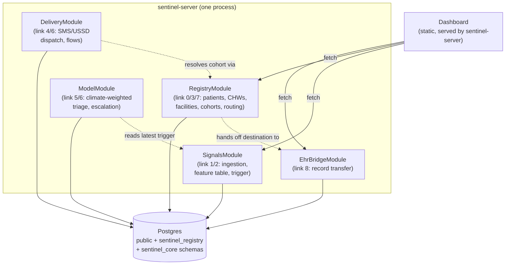

# sentinel-stack

Reference deployment for **Sentinel**, an open-source climate-health
intelligence stack. This repo composes [ehr-bridge](../ehr-bridge),
[ehr-bridge-sdk](../ehr-bridge-sdk) and [sentinel](../sentinel) into **one
process and one Postgres database**, plus a synthetic demo scenario and a
minimal dashboard.

## What this is — and isn't, yet

The chain this stack closes: a climate signal flags an affected zone, the
at-risk patient cohort in that zone is resolved, patients and their
community health workers (CHWs) are contacted, a patient is triaged with
climate context applied, an elevated case is escalated, a receiving
facility is selected under real-world constraints, and the patient's record
is transferred ahead of their arrival.

**Live in this repo:** the full chain runs end to end, against real
Postgres-backed state, with zero external dependencies, zero API keys, and
zero trained model weights. **Not live:** the risk model is an unvalidated
baseline (see `sentinel/src/signals/models/baseline-trigger.model.ts`), the
inference backend is a zero-weight mock by default, SMS is a mock adapter by
default, and voice is out of scope for this release entirely. See each
repo's `ROADMAP.md` for the shipped-vs-funded line.

## Architecture



One deployable server, five repos — repos and running processes are
separate concerns. `ehr-bridge` and `sentinel` each also ship their own
standalone `main.ts`, so `ehr-bridge` can be deployed alone by an EHR vendor
already running it, or `sentinel` alone by a country office with its own
FHIR layer. This repo is the reference way to run all of them together.

## Quickstart

Requires Docker with Compose v2.17+ (BuildKit-enabled, the default since
Docker 23) — this repo's build uses named multi-repo build contexts, not a
shared parent directory, so it never touches anything outside these four
repos.

```bash
git clone <org>/ehr-bridge
git clone <org>/ehr-bridge-sdk
git clone <org>/sentinel
git clone <org>/sentinel-stack
cd sentinel-stack
docker compose up
```

Then, once healthy:

```bash
BASE_URL=http://localhost:3000 npx ts-node scripts/run-scenario.ts
```

Open `http://localhost:3000` for the dashboard.

No `.env` file is required — every credential in `docker-compose.yml` has a
working development default. Override them via `.env` (see `.env.example`)
before deploying anywhere real.

### Running the demo scenario

`scripts/run-scenario.ts` walks the full nine-link chain against the running
API: creates a zone, a facility, a CHW and a patient; ingests synthetic
climate data; evaluates the zone trigger; resolves the cohort; dispatches an
SMS campaign to patients and CHWs (mock adapter — nothing real is sent);
runs a climate-weighted assessment; and selects a receiving facility under
constraint. One `correlationId` is threaded through every step, so the run
reconstructs as a single timeline in the server logs.

The one link the script doesn't exercise automatically is the ehr-bridge
record transfer (link 8), since that requires two connected partner systems
already set up — see `ehr-bridge/docs/CONNECTION_FLOW.md`, or
`ehr-bridge/src/modules/transfers/transfers.service.spec.ts` for that path
tested directly.

## Configuration

| Variable | Purpose | Default |
|---|---|---|
| `DATABASE_URL` | Shared Postgres connection | compose-provided |
| `ADMIN_API_KEY` | ehr-bridge admin API | dev default — **change for real use** |
| `ADMIN_SECRET_ENCRYPTION_KEY` | Encrypts partner secrets at rest | dev default — **change for real use** |
| `PATIENT_IDENTIFIER_SYSTEM` | FHIR identifier namespace | `urn:ehr-bridge:source-patient-id` |
| `INFERENCE_BACKEND` | `mock` or `http` | `mock` |
| `MODEL_API_URL` / `MODEL_API_KEY` | Used when `INFERENCE_BACKEND=http` | unset |
| `AT_API_KEY` / `AT_USERNAME` | Africa's Talking SMS | unset (mock adapter) |

## Project structure

```
sentinel-stack/
  src/            composed NestJS app (imports EhrBridgeModule + sentinel's modules)
  scripts/        run-scenario.ts — the nine-link demo
  web/public/     static dashboard, served by sentinel-server
  docker-compose.yml, Dockerfile, docker-entrypoint.sh
```

## Testing

This repo has no service-layer logic of its own to unit test — it's
composition, a demo script, and a static dashboard. The tested logic lives
in `ehr-bridge` and `sentinel` (`yarn test` in each). `docker-entrypoint.sh`
pushing schema and starting the server is this repo's integration test,
exercised by `docker compose up` itself.

## Roadmap

See `ROADMAP.md`.

## Contributing

See `../sentinel/CONTRIBUTING.md` — the same conventions apply here.

## License

Apache-2.0 — see `LICENSE`.
